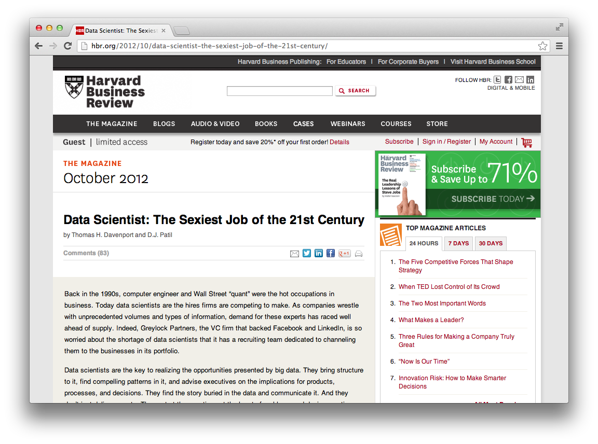
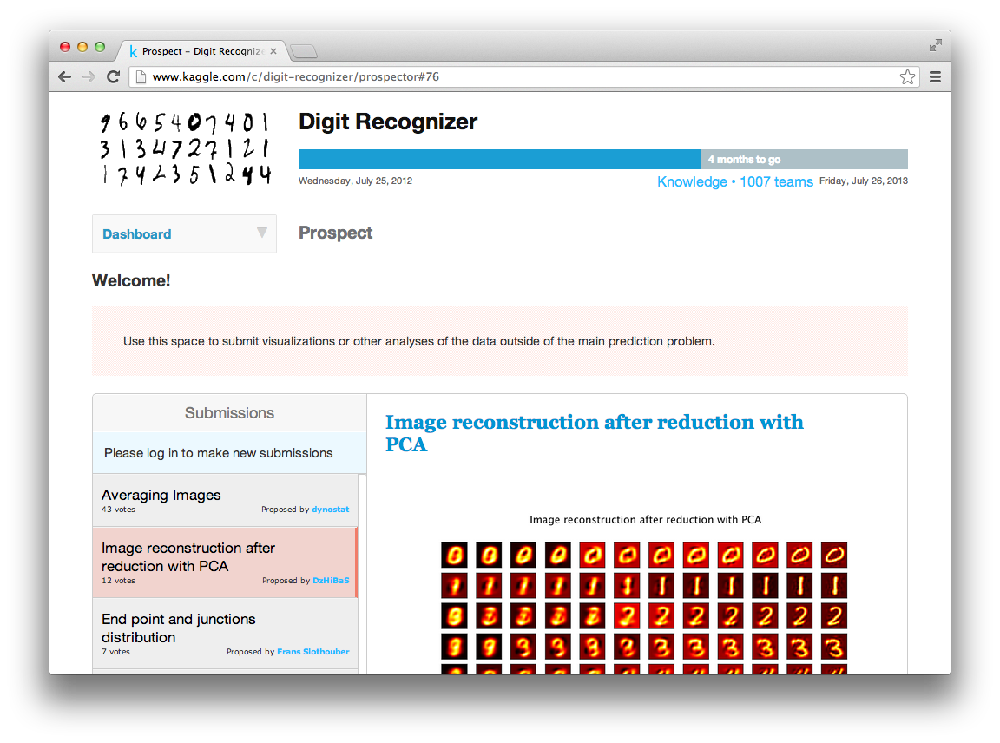

---

title       : "Data Jumpstart : R"
subtitle    : "bit.ly/NYUjumpstartR : #NYUjumpstartR"
author      : "Aaron Schumacher : aaron.schumacher@nyu.edu : @planarrowspace"
job         : "Senior Data Services Specialist : NYU Data Services"
biglogo     : data_services_logo.png
framework   : io2012        # {io2012, html5slides, shower, dzslides, ...}
highlighter : highlight.js  # {highlight.js, prettify, highlight}
hitheme     : tomorrow      # {tomorrow, solarized_light}
widgets     : []            # {mathjax, quiz, bootstrap}
mode        : selfcontained # {standalone, draft}
license     : by-nc-sa
github:
  user: ajschumacher
  repo: Data_Jumpstart_R

---

```{r setup, echo=FALSE}
set.seed(42)
options(stringsAsFactors = FALSE)
library(ggplot2)
```

<center>
 <a style='border-bottom:none;' href='http://hbr.org/2012/10/data-scientist-the-sexiest-job-of-the-21st-century/'>
  
 </a>
</center>

---

## Classwork

If you haven't yet, join these sites:

* [meetup](http://www.meetup.com/)
* [github](https://github.com/)
* [kaggle](http://www.kaggle.com/)

---

<center>
 <a style='border-bottom:none;' href='http://www.meetup.com/'>
  
 </a>
</center>

---
<center>
 <a style='border-bottom:none;' href='https://github.com/'>
  
 </a>
</center>

---

<center>
 <a style='border-bottom:none;' href='http://www.kaggle.com/'>
  
 </a>
</center>

---

## Homework

If you haven't yet, do these cool things:

* Participate in a good tech meetup.
* Learn git and use github for a project.
* Enter a kaggle competition.

---

<center>
 <a style='border-bottom:none;' href='http://www.meetup.com/how-to-javascript/events/97065712/'>
  
 </a>
</center>

---
<center>
 <a style='border-bottom:none;' href='http://try.github.com/'>
  
 </a>
</center>

---

<center>
 <a style='border-bottom:none;' href='http://www.kaggle.com/c/digit-recognizer/prospector#76'>
  
 </a>
</center>

---

<center>
 <a style='border-bottom:none;' href='http://datascience.nyu.edu/yann-lecun-and-john-langford-co-teaching-new-course-large-scale-machine-learning-and-big-data/'>
  
 </a>
</center>

--- &twocol

## [NYU Data Services](http://bit.ly/nyudataservices)

*** left

* [Computer lab, Bobst 5](http://nyu.libguides.com/content.php?pid=38898&sid=1496756)
* [Workshops/Tutorials](http://bit.ly/datatutorials)
* [Individual consultations](http://bit.ly/datameeting)

*** right

* ArcGIS
* Google Earth
* SPSS
* Stata
* SAS
* R
* MATLAB
* ATLAS.ti
* Qualtrics Surveys
* High Performance Computing
* Data Finding
* Data Management Planning

--- &twocol

## Intermediate Topics in R

*** left

* Formulas in R (for models, plots, ...)
* Working with (model) objects (lm, glm, ...)
* Programming: functions
* Programming: flow control (if, for, while, ...)
* Data set manipulation (merge, wide/long, ...)
* Munging strings, dates, etc.
* SQL in R (select * from ...)
* 2-D plotting (base, lattice, ggplot2)
* Network (graph) visualization
* PCA / clustering / 3-D plotting

*** right

* Please ask questions!
* Please fill out our [survey](http://bit.ly/NYUtopicRsurvey) afterward!

---

## Data set: `iris`

```{r, tidy=FALSE}
data(iris)  #  Load included data set into your workspace.
str(iris)   #  Display structure of data set.
```

---

## Presentation code:

<iframe src="index.txt" height=600px /></iframe>

---

## Formulas in R

Formula notation featuring '`~`' is used in various forms across much of R:

* Defining models

```{r, eval=FALSE}
lm(Sepal.Length ~ Species, data=iris)
```

* Aggregating / reshaping data

```{r, eval=FALSE}
aggregate(Sepal.Length ~ Species, data=iris, FUN=mean)
```

* Plotting

```{r, eval=FALSE}
boxplot(Sepal.Length ~ Species, data=iris)
```

---

## Formulas in R

This model is based on a categorical variable, an interaction, the log of a variable, and zero intercept:

```{r, eval=FALSE, tidy=FALSE}
lm(Sepal.Length ~ Species + Species:Petal.Length + log(Petal.Width) - 1, data=iris)
?formula  #  More help for model formulas.
```

Use '`.`' to select all otherwise unused variables in a data frame:

```{r, eval=FALSE}
aggregate(. ~ Species, data=iris, FUN=mean)
```

In `lattice` the bar ('`|`') introduces small multiples conditioned on what follows:

```{r, eval=FALSE}
library(lattice)
xyplot(Sepal.Length ~ Sepal.Width | Species, data=iris)
```

---

## Working with (model) objects

R functions often return some sort of 'results object' which you can continue to work with.

This is the case for model objects:

```{r}
my.model <- lm(Sepal.Length ~ .*., data=iris)  # Create an abominable model.
```

The model object contains lots of things, which you can look at this way but likely won't:

```{r, eval=FALSE}
str(my.model) # View the complete structure of the model object.
```

(`str`, like many R functions, is generic - it works on many types of objects.)

---

## Working with (model) objects

Often instead of doing things like this:

```{r, eval=FALSE}
cor(my.model$fitted.values, my.model$model$Sepal.Length)^2
```

you can use generic functions like these:

```{r, eval=FALSE, tidy=FALSE}
my.model  #  This is equivalent to print(my.model)
summary(my.model)
deviance(my.model)
residuals(my.model)
plot(my.model)
coef(my.model)
confint(my.model)
vcov(my.model)
predict(my.model,
        data.frame(Sepal.Width=10, Petal.Length=10, Petal.Width=10, Species='setosa'))
```

---

## Programming: functions

Functions are objects. You can make your own like this:

```{r}
times.four <- function(formal.argument) {
  four <- 4
  return(formal.argument*four)
}

times.four(7)
print(four)   #  Only exists inside the function.
```

---

## Programming: functions

Anonymous functions are also frequently useful. Compare these:

```{r, tidy=FALSE}
aggregate(. ~ Species, data=iris, FUN=max)
aggregate(. ~ Species, data=iris, FUN=function(x) { return(max(x) - 1) } )
```

---

## Programming: flow control

The first rule of for loops is you do not write explicit for loops.

```{r}
x = 0
for (i in 1:length(iris$Sepal.Length)) {
  x <- x + iris$Sepal.Length[i]
}
x
```

The above works, but as is often the case it is better to do it the R way:

```{r}
(x <- sum(iris$Sepal.Length))
```

---

## Programming: flow control

The second rule of for loops is you DO NOT write explicit for loops.

```{r, eval=FALSE}
iris$Sepal.Long <- NA
for (i in 1:length(iris$Sepal.Length)) {
  if (iris$Sepal.Length[i] > mean(iris$Sepal.Length)) {
    iris$Sepal.Long[i] <- 'yes'
  } else {
    iris$Sepal.Long[i] <- 'no'
  }
}
```

Seriously, avoid that. There are vectorized ways to do many things:

```{r, eval=FALSE, tidy=FALSE}
iris$Sepal.Long <- ifelse(iris$Sepal.Length > mean(iris$Sepal.Length),
                          'yes', 'no')
```

---

## Programming: flow control

Of course there are cases where you will want to use flow control, and you can use it:

```{r, eval=FALSE, tidy=FALSE}
for (i in 1:10) { print(i) }
i=0; while (i < 10) { i <- i + 1; print(i) }
i=0; repeat { i <- i + 1; print(i); if (i == 10) { break }} # `next` is also available
# There is also a `switch` statment.
```

Be careful with if/else constructs especially if  you might have missing values. What happens here?

```{r, eval=FALSE}
i <- NA
if (i > 3) {
  print('Big!')
} else if (i < 3) {
  print('Small!')
} else {
  print('Three!')
}
```

---

## Data set manipulation

Bind columns with `cbind`:

```{r, eval=TRUE, tidy=FALSE}
colors <- cbind(data.frame(Species=c('setosa', 'versicolor')),
                data.frame(Color=c('pink', 'orange')))
```

Bind rows with `rbind`:

```{r, eval=TRUE, tidy=FALSE}
colors <- rbind(colors,
                data.frame(Species='virginica', Color='purple'))
colors
```

---

## Data set manipulation

Merging with `merge` is easy and fun. It merges on common column names and does a natural (inner) join by default. See `?merge` for all the details.

```{r, eval=TRUE, tidy=FALSE}
iris <- merge(iris, colors)
iris[sample(nrow(iris), 6),]
```

---

## Data set manipulation

Going from long to wide is easy with the `reshape` package:

```{r, message=FALSE}
library(reshape)
iris$Year <- rep(1951:2000, 3)  # Imagine longitudinal flowers. Imagine.
head(iris)
```

---

## Data set manipulation

Going from wide to long with `melt`:

```{r}
head(molten <- melt(iris, id=c('Species', 'Year')))
```

The column names `variable` and `value` are just defaults.

---

## Data set manipulation

Going from long to wide with `cast`:

```{r}
head(cast(molten))
```

---

## Munging strings, dates, etc.

Suppose we want to abbreviate the species names:

```{r}
iris$Species_short <- substr(iris$Species, 1, 4)  #  'sub-string'
table(iris$Species_short)
```

Also sometimes useful: `toupper`, `tolower`, `strsplit`.

---

## Munging strings, dates, etc.

Or remove vowels from the color names:

```{r}
iris$Clr <- gsub('[aeiou]', '', iris$Color)  # more commonly used for white-space removal
table(iris$Clr)
```

There is solid support for regular expressions and of course `grep`. See `?regex` and `?grep`.

```{r}
grep('Length', names(iris), value=TRUE)
```

---

## Munging strings, dates, etc.

Right now `Year` is an integer.

```{r}
str(iris$Year)
```

Let's change it into a date. First, we make it into a character string.

```{r}
iris$Date <- as.character(iris$Year)
str(iris$Date)
```

---

## Munging strings, dates, etc.

Now we can make it into a date.

```{r}
head(as.Date(iris$Date, format="%Y"))
```

By default it takes today's day and month. (For `format` details see `?strptime`.) Let's specify January 1st, by using `paste` to stick strings together.

```{r}
head(paste(iris$Date, '01', '01', sep='-'))
```

---
## Munging strings, dates, etc.

Finally, we can make real dates:

```{r}
iris$Date <- as.Date(paste(iris$Date, '01', '01', sep='-'))
str(iris$Date)
```

Dates can be a big pain. See also the package `lubridate` if you have to deal with them a lot.

---

## SQL in R

Structured Query Language (SQL) is very popular for working with data, especially when that data lives in a relational database.

There are two main ways that SQL can be used in R:

* R can act as a client of an external relational database and pull in data with SQL queries.
* R can generate and use a relational database on the fly using data already in R, which can be convenient and sometimes more performant.

---

## SQL in R

R can act as a client of an external relational database and pull in data with SQL queries.

This example connects to a Microsoft SQL Server database and pulls some data in from it.

```{r, eval=FALSE}
library(RODBC)
db27 <- odbcDriverConnect('driver={SQL Server};server=mtsqlvs27\\mtsqlins27;trusted_connection=true')
results <- sqlQuery(db27,"select * from spr_int.prl.raw_register_audit where year = 2012")
```

The particular library and/or connect string will vary depending on the database you're connecting to.

---

## SQL in R

R can generate and use a relational database on the fly using data already in R, which can be convenient and sometimes more performant.

```{r, eval=FALSE}
library(sqldf)
results <- sqldf("select Species, Date from iris where Petal_Length > 2 limit 6")
```

SQL is a well-known and fairly powerful language for data manipulation. Some people will find it easier to use SQL selects and joins than native R equivalents for working with data.

---

## 2-D plotting: base graphics

Without loading any packages, you can make graphics like this. There are a range of plotting functions, but many of the argument names are consistent across them.

```{r, eval=FALSE, tidy=FALSE}
plot(Sepal.Length ~ Sepal.Width,
     col = Color,
     data = iris,
     xlab = "Sepal Width, centimeters",
     ylab = "Sepal Length, centimeters",
     main = "Sepal Measurements for 150 Irises",
     pch = 19,
     cex = 0.8,
     xlim = c(1, 6),
     ylim = c(4, 9))
legend("topright", legend = colors$Species, col = colors$Color, pch = 19)
```

More base graphics functions: `hist`, `boxplot`, `pairs`, `barplot`, `points`, `lines`, `text`, `polygon`. The `type` argument for `plot` is also good. To do multiple plots at once, use, e.g., `par(mfrow=c(2, 2))`.

---

## 2-D plotting: `lattice`

Loading the `lattice` package, you can make graphics like this. Some of the options are similar to base graphics, and some are not.

```{r, eval=FALSE, tidy=FALSE}
xyplot(Sepal.Length ~ Sepal.Width,
       data = iris,
       xlab = "Sepal Width, centimeters",
       ylab = "Sepal Length, centimeters",
       main = "Sepal Measurements for 150 Irises",
       xlim = c(1, 6),
       ylim = c(4, 9),
       groups = Species,
       par.settings = list(superpose.symbol = list(col = colors$Color,
                                                   pch = 19,
                                                   cex = 0.8)),
       auto.key = list(corner=c(1, 1)))
```

More `lattice` functions: `histogram`, `bwplot`, `splom`, `barchart`. To do multiple plots at once, usually you want a `|` conditional in your plotting formula to get small multiples.

---

## 2-D plotting: `ggplot2`

Loading the `ggplot2` package, you can make graphics like this. Syntax is quite different from base graphics and `lattice`. It's based on [The Grammar of Graphics](http://www.amazon.com/Grammar-Graphics-Statistics-Computing/dp/0387245448).

```{r, eval=FALSE, tidy=FALSE}
g <- ggplot(data = iris, aes(x = Sepal.Width,
                             y = Sepal.Length,
                             colour = Species))
g <- g + geom_point()  # Many more; see http://docs.ggplot2.org/current/index.html
g <- g + theme_bw()    # I happen to prefer this theme.
g <- g + labs(title = "Sepal Measurements for 150 Irises")
g <- g + scale_x_continuous(name = "Sepal Width, centimeters",
                            limits = c(1, 6))
g <- g + scale_y_continuous(name = "Sepal Length, centimeters",
                            limits = c(4, 9))
g <- g + scale_color_manual(values = colors$Color)
g <- g + theme(legend.position=c(0.8, 0.8))
g
```

The `qplot` function is also available for quick plots using syntax more similar to base graphics.

---

## Network (graph) visualization

This is popular lately. I describe it on my [blog](http://planspace.org/2013/01/30/visualize-co_occurrence/).

```{r, eval=FALSE}
data <- read.table(header=T, row.names=1, text=
"    the fat cat
 one   1   1   0
 two   1   0   1
 three 1   2   1")

total_occurrences <- colSums(data)
data_matrix <- as.matrix(data)

co_occurrence <- t(data_matrix) %*% data_matrix

library(igraph)
graph <- graph.adjacency(co_occurrence,
                         weighted=TRUE,
                         mode="undirected",
                         diag=FALSE)

plot(graph,
     vertex.label=names(data),
     vertex.size=total_occurrences*18,
     edge.width=E(graph)$weight*8)

tkplot(graph,
     vertex.label=names(data),
     vertex.size=total_occurrences*18,
     edge.width=E(graph)$weight*8)
```

---

## PCA / clustering / 3-D plotting

This is also fun and described on my [blog](http://planspace.org/2013/02/03/pca-3d-visualization-and-clustering-in-r/).

```{r, eval=FALSE}
Iris <- iris
data(iris)
iris$Species <- factor(iris$Species,
                       levels = c("versicolor","virginica","setosa"))

round(cor(iris[,1:4]), 2)

pc <- princomp(iris[,1:4], cor=TRUE, scores=TRUE)

summary(pc)

# scree plot
plot(pc,type="lines")

biplot(pc)

library(rgl)
plot3d(pc$scores[,1:3], col=iris$Species)

text3d(pc$scores[,1:3],texts=rownames(iris))
text3d(pc$loadings[,1:3], texts=rownames(pc$loadings), col="red")
coords <- NULL
for (i in 1:nrow(pc$loadings)) {
  coords <- rbind(coords, rbind(c(0,0,0),pc$loadings[i,1:3]))
}
lines3d(coords, col="red", lwd=4)

set.seed(42)
cl <- kmeans(iris[,1:4],3)
iris$cluster <- as.factor(cl$cluster)

plot3d(pc$scores[,1:3], col=iris$cluster, main="k-means clusters")
plot3d(pc$scores[,1:3], col=iris$Species, main="actual species")

with(iris, table(cluster, Species))

di <- dist(iris[,1:4], method="euclidean")
tree <- hclust(di, method="ward")
iris$hcluster <- as.factor((cutree(tree, k=3)-2) %% 3 +1)
# that modulo business just makes the coming table look nicer
plot(tree, xlab="")
rect.hclust(tree, k=3, border="red")

with(iris, table(hcluster, Species))
```

---

## Thank you! Questions! Survey!

<center>
### [http://bit.ly/NYUtopicRsurvey](http://bit.ly/http://bit.ly/NYUtopicRsurvey)
</center>
