---

title       : "Data Jumpstart : R"
subtitle    : "bit.ly/NYUjumpstartR : #NYUjumpstartR"
author      : "Aaron Schumacher : aaron.schumacher@nyu.edu : @planarrowspace"
job         : "Senior Data Services Specialist : NYU Data Services"
biglogo     : data_services_logo.png
framework   : io2012        # {io2012, html5slides, shower, dzslides, ...}
highlighter : highlight.js  # {highlight.js, prettify, highlight}
hitheme     : tomorrow      # {tomorrow, solarized_light}
widgets     : []            # {mathjax, quiz, bootstrap}
mode        : selfcontained # {standalone, draft}
license     : by-nc-sa
github:
  user: ajschumacher
  repo: Data_Jumpstart_R

---

## Overview

* Data street cred (get some)
* What is the deal with data?
* Introduction to a bunch of tools
* R walk-through: attendance data
* R exploring: plotting with `ggplot2`
* Further opportunities

---

 <a style='border-bottom:none;' href='https://twitter.com/B_I_G_data/status/302505194330152960'>
  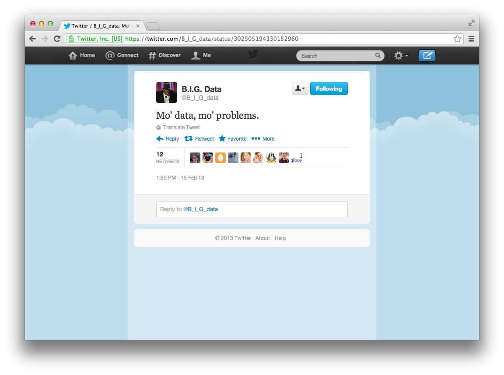
 </a>

---

## Classwork

If you haven't yet, join these sites:

* [meetup](http://www.meetup.com/)
* [github](https://github.com/)
* [kaggle](http://www.kaggle.com/)

---

 <a style='border-bottom:none;' href='http://www.meetup.com/'>
  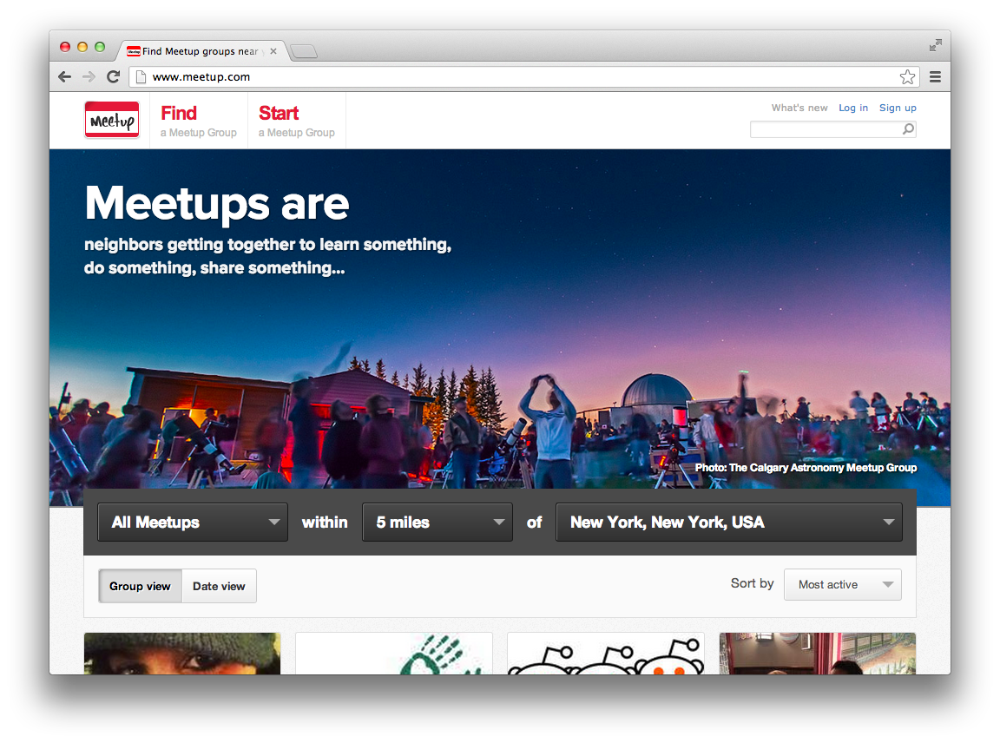
 </a>

---

 

---

 <a style='border-bottom:none;' href='http://www.kaggle.com/'>
  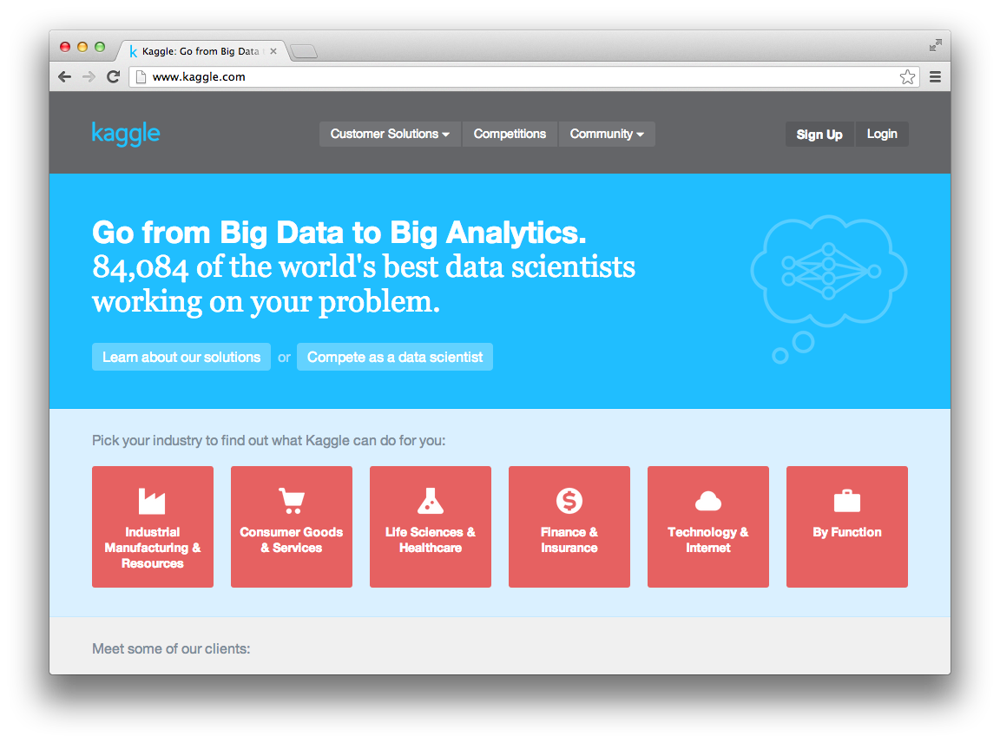
 </a>

--- &twocol

## Who am I?

*** left

History:
* Studied math and education
* Taught in NYC and Korea
* Analyst for NYCDOE
* Now Data Services for NYU

My web sites:
* [planspace.org](http://planspace.org/) (blog)
* [mcasta.net](http://mcasta.net/) (math)
* [naldaramjui.com](http://naldaramjui.com/) (Korean)
* [skribi.es](http://skribi.es/) (simple form)

*** right

Interests:
* education
* data
* the internet
* open everything

My profiles:
* [github.com/ajschumacher/](http://github.com/ajschumacher/)
* [kaggle.com/u/41254](http://kaggle.com/u/41254)
* [linkedin.com/in/ajschumacher/](http://www.linkedin.com/in/ajschumacher/)

---

## Homework

If you haven't yet, do these cool things:

* Participate in a good tech meetup.
* Learn git and use github for a project.
* Enter a kaggle competition.

---

 <a style='border-bottom:none;' href='http://www.meetup.com/how-to-javascript/events/97065712/'>
  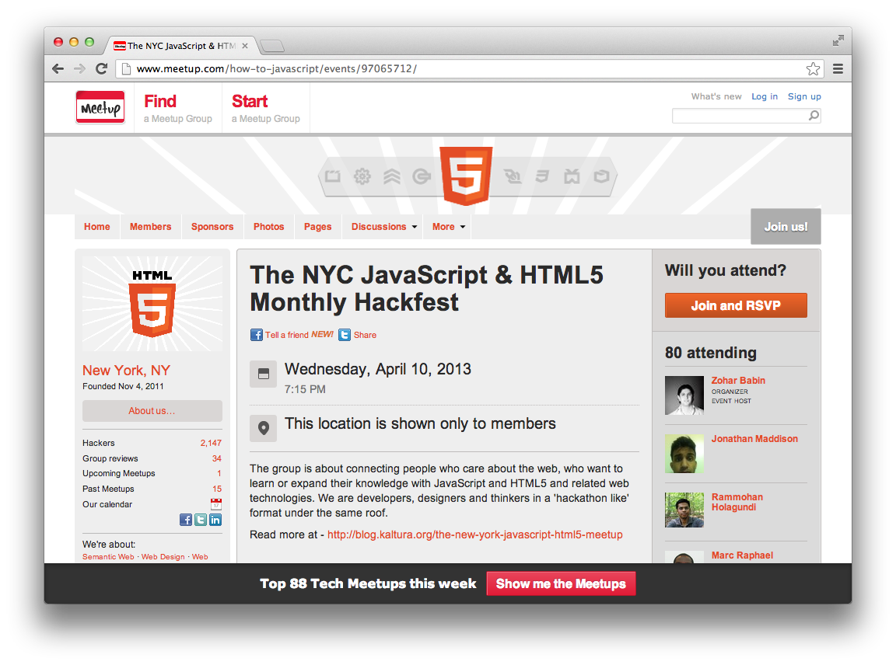
 </a>

---

 <a style='border-bottom:none;' href='http://try.github.com/'>
  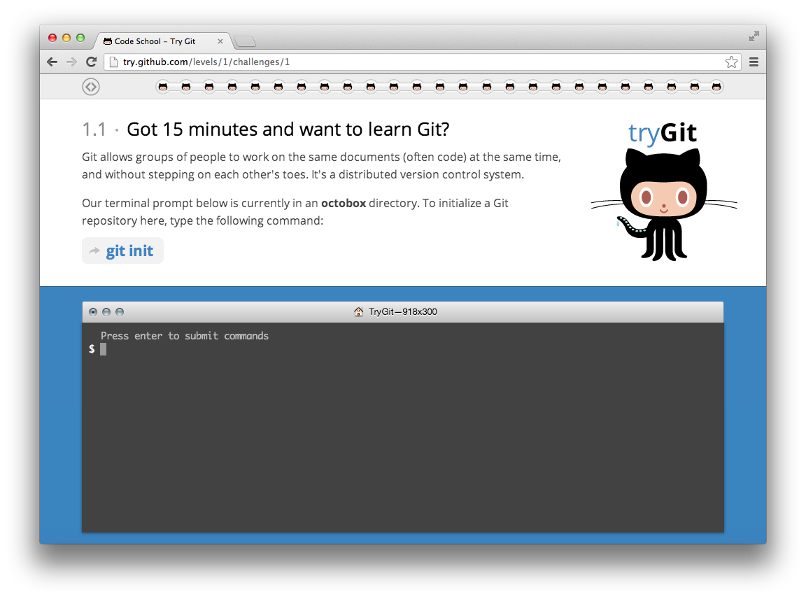
 </a>

---

 

---

## What is the deal with data?

* Lots of it
* Possibly useful
* People get excited.
    * They start saying "big data" a lot.
    * They start saying "data scientist" a lot.

---

 <a style='border-bottom:none;' href='http://www.microsoft.com/en-us/news/features/2013/feb13/02-11BigData.aspx'>
  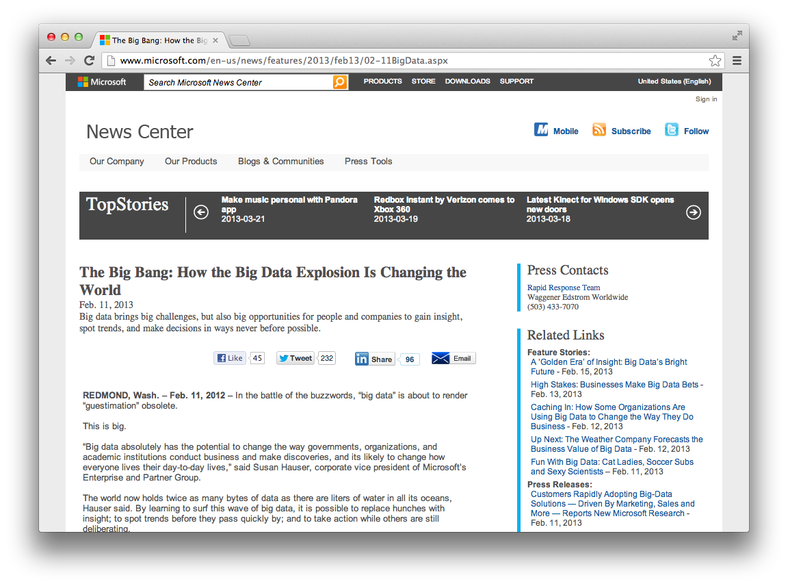
 </a>

---

 <a style='border-bottom:none;' href='http://www.csee.wvu.edu/~gidoretto/courses/2011-fall-cp/reading/TheUnreasonable%20EffectivenessofData_IEEE_IS2009.pdf'>
  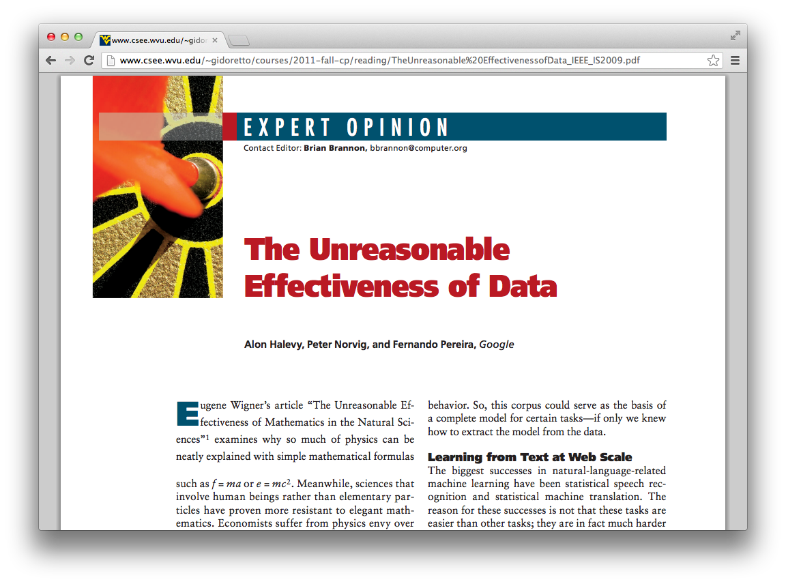
 </a>

---

 <a style='border-bottom:none;' href='http://hbr.org/2012/10/data-scientist-the-sexiest-job-of-the-21st-century/'>
  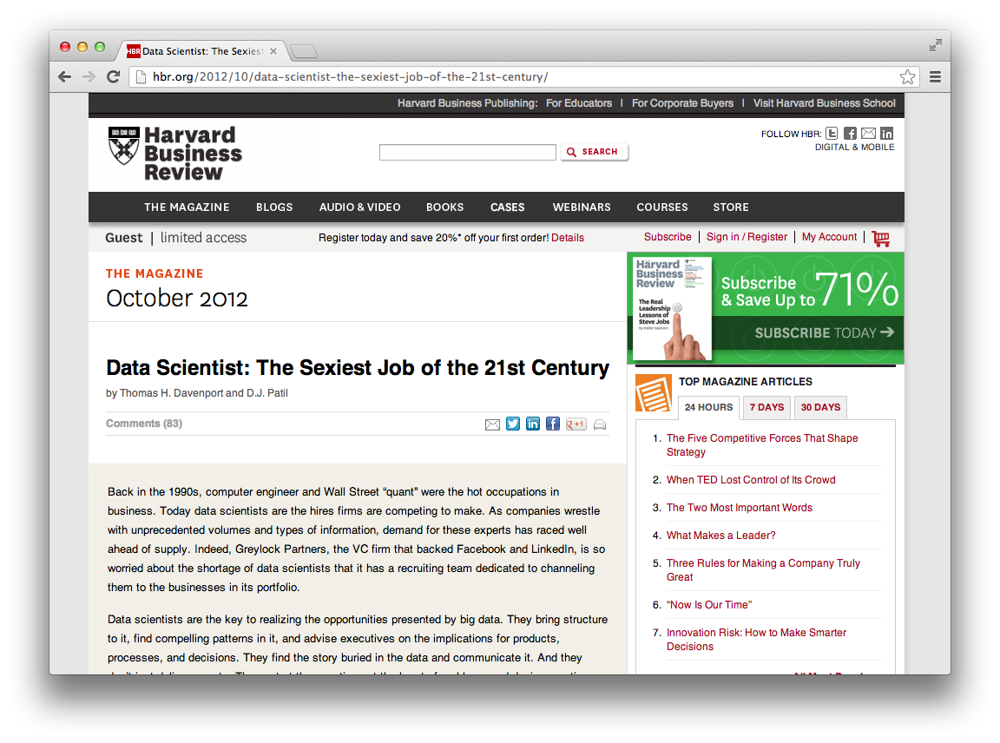
 </a>

---

 

---

  

---

 <a style='border-bottom:none;' href='http://datascience.nyu.edu/yann-lecun-and-john-langford-co-teaching-new-course-large-scale-machine-learning-and-big-data/'>
  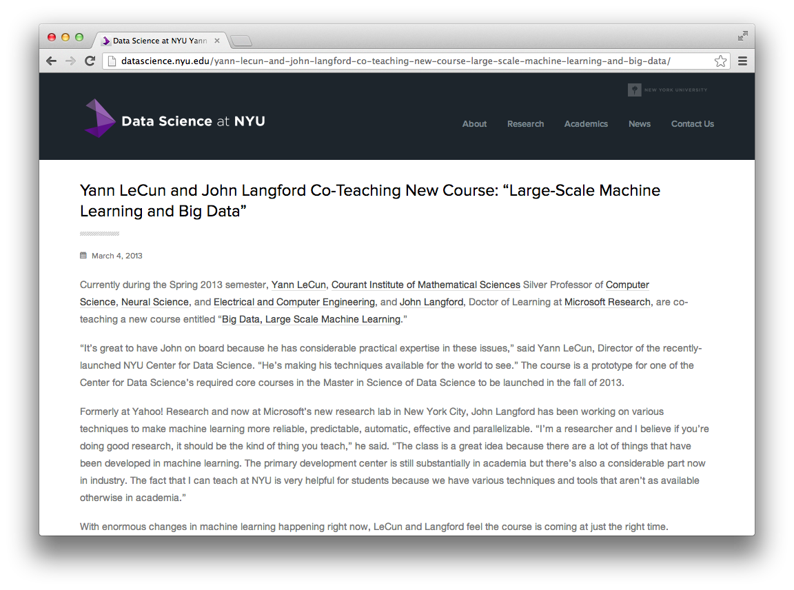
 </a>

--- &twocol

## [NYU Data Services](http://bit.ly/nyudataservices)

*** left

* [Computer lab, Bobst 5](http://nyu.libguides.com/content.php?pid=38898&sid=1496756)
* [Workshops/Tutorials](http://bit.ly/datatutorials)
* [Individual consultations](http://bit.ly/datameeting)

*** right

* ArcGIS
* Google Earth
* SPSS
* Stata
* SAS
* R
* MATLAB
* ATLAS.ti
* Qualtrics Surveys
* High Performance Computing
* Data Finding
* Data Management Planning

---

## GIS (Geographic) Software

* ArcGIS
* Google Earth

---

 <a style='border-bottom:none;' href='http://www.esri.com/software/arcgis'>
  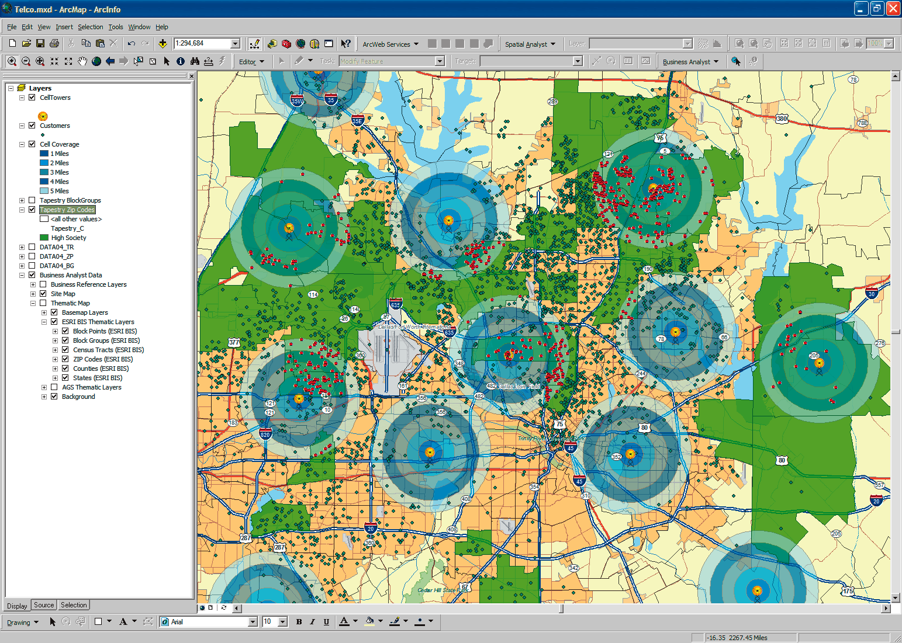
 </a>

---

 <a style='border-bottom:none;' href='http://www.google.com/earth/index.html'>
  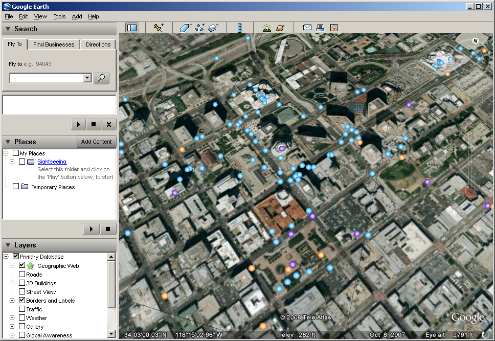
 </a>

---

## Quantitative Software

* SPSS
* Stata
* SAS
* R
* MATLAB

---

 <a style='border-bottom:none;' href='http://www-01.ibm.com/software/analytics/spss/'>
  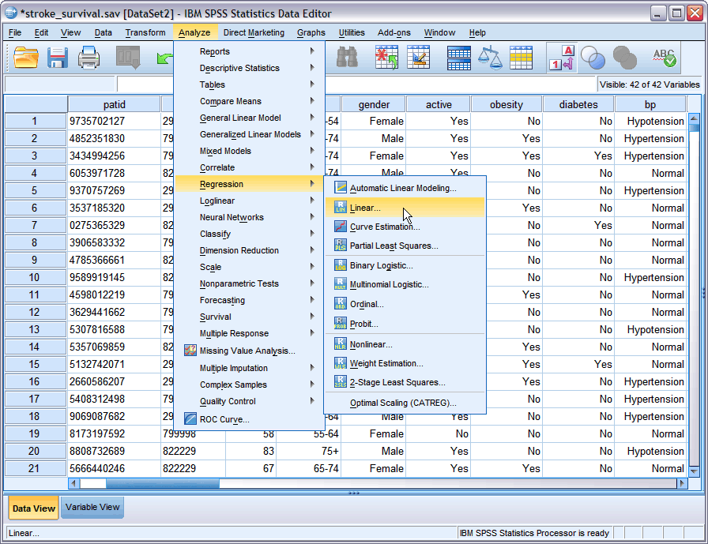
 </a>

---

 <a style='border-bottom:none;' href='http://www.stata.com/'>
  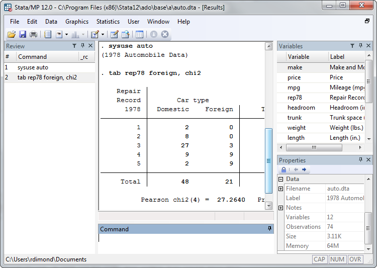
 </a>

---

 <a style='border-bottom:none;' href='http://www.sas.com/'>
  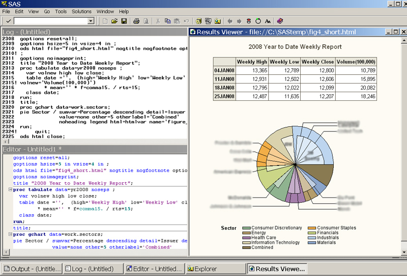
 </a>

---

 

---

 <a style='border-bottom:none;' href='http://www.mathworks.com/products/matlab/'>
  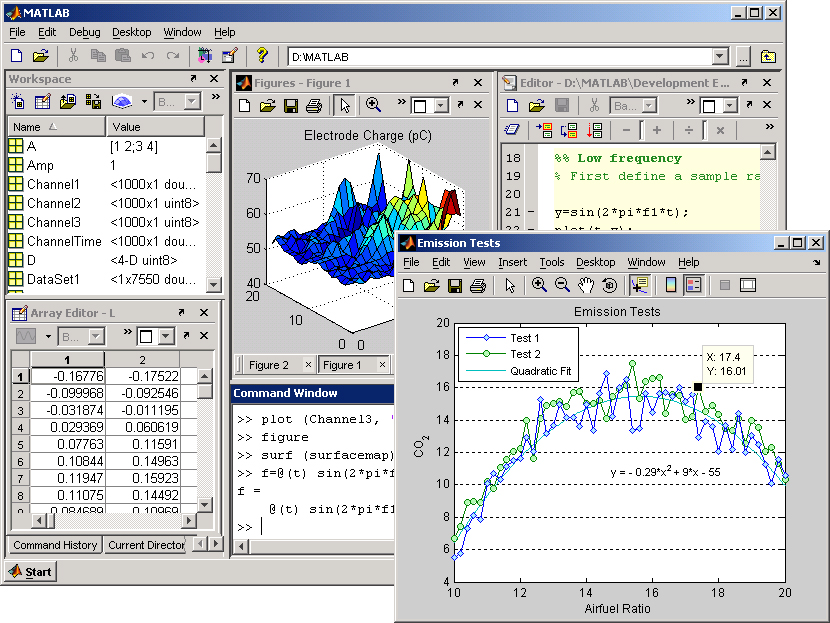
 </a>

---

## Qualitative and Survey Software

* ATLAS.ti
* Qualtrics Surveys

---

 <a style='border-bottom:none;' href='http://www.atlasti.com/'>
  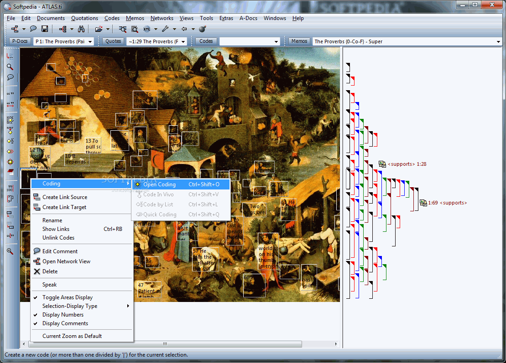
 </a>

---

 <a style='border-bottom:none;' href='http://nyu.qualtrics.com/'>
  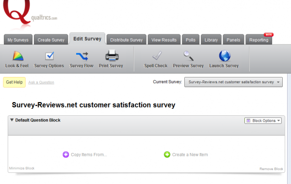
 </a>

---

## Further services:

* [High Performance Computing](https://wikis.nyu.edu/display/NYUHPC/High+Performance+Computing+at+NYU)
* Data Finding
* Data Management Planning

---

## Also worth being aware of:

* Python for data analysis and some web scraping is also supported by Data Services.
* Hadoop for big data at NYU is experimental for now but may expand.
* There are way more tools. Way more.

--- &twocol

## Things we won't cover today:

*** left

[Introduction to R](http://bit.ly/NYUintroR):

* Why use R?
* What is R / RStudio?
* Everything is a function.
* Everything is a vector.
* ... Data Frames!
* Some statistics
* Base graphics
* More!

*** right

[Intermediate Topics in R](http://bit.ly/NYUtopicR)

* Formulas in R (for models, plots, ...)
* Working with (model) objects (lm, glm, ...)
* Programming: functions
* Programming: flow control (if, for, while, ...)
* Data set manipulation (merge, wide/long, ...)
* Munging strings, dates, etc.
* SQL in R (select * from ...)
* 2-D plotting (base, lattice, ggplot2)
* Network (graph) visualization
* PCA / clustering / 3-D plotting

---

## RStudio

 <a style='border-bottom:none;' href='http://www.rstudio.com/'>
  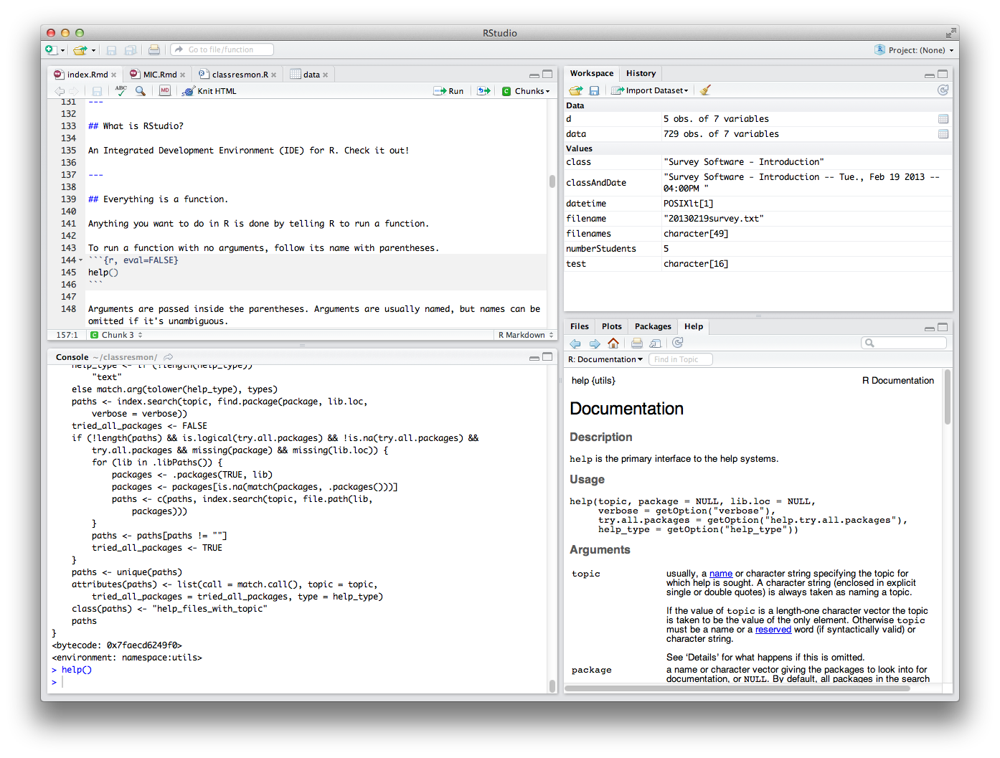
 </a>

---

## R walk-through: attendance data:

<iframe src="attendanceR.txt" height=600px /></iframe>

---

## R exploring: plotting with `ggplot2`

<iframe src="ggplottingR.txt" height=600px /></iframe>

---

## Further independent resources on R

* [Try R](http://tryr.codeschool.com/): A free online interactive tutorial
* [A Beginners Guide to R](http://www.amazon.com/Beginners-Guide-Use-Alain-Zuur/dp/0387938362/) (book)
* [The Art of R Programming](http://www.amazon.com/The-Art-Programming-Statistical-Software/dp/1593273843/) (book)

---

 

---

 <a style='border-bottom:none;' href='http://www.amazon.com/Beginners-Guide-Use-Alain-Zuur/dp/0387938362/'>
  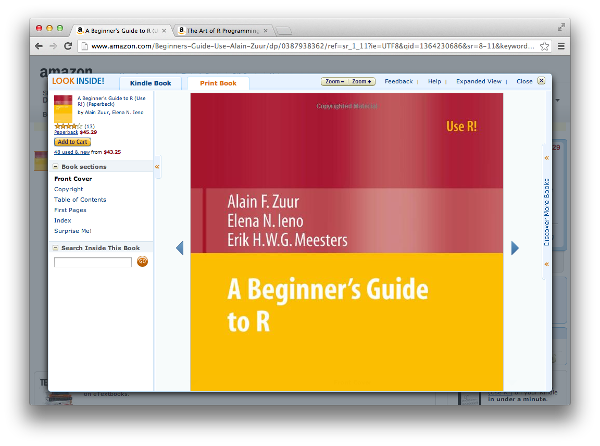
 </a>

---

 <a style='border-bottom:none;' href='http://www.amazon.com/The-Art-Programming-Statistical-Software/dp/1593273843/'>
  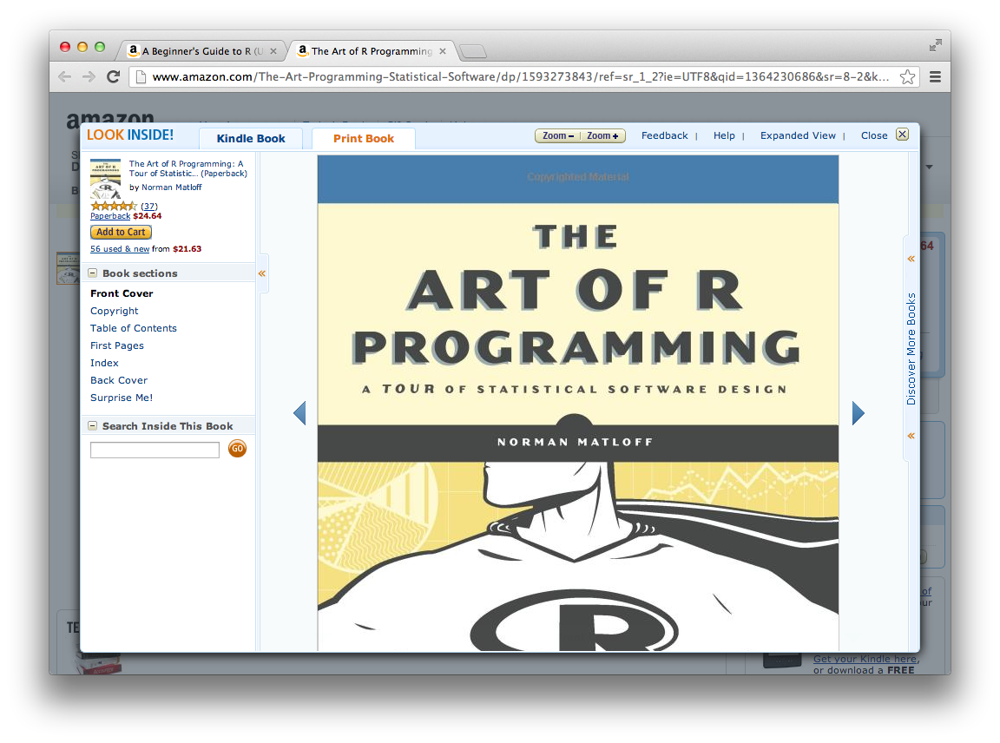
 </a>

---

## Thank you! Questions! Be great!

### [bit.ly/nyudataservices](http://bit.ly/nyudataservices)
### [data.services@nyu.edu](mailto:data.services@nyu.edu)

